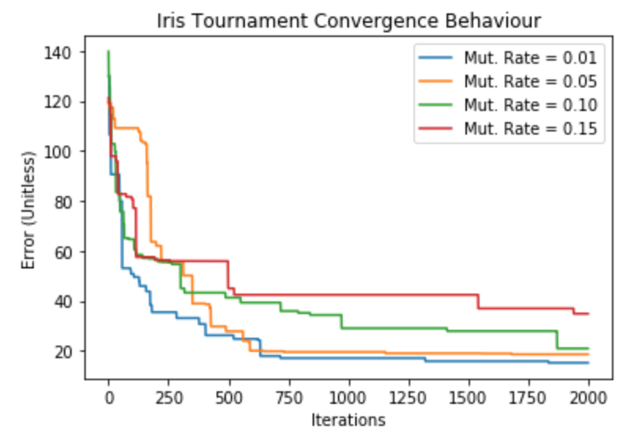
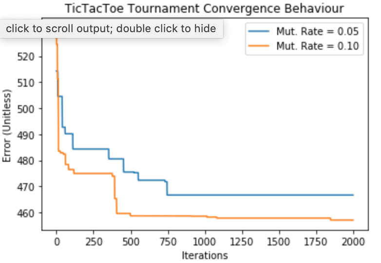
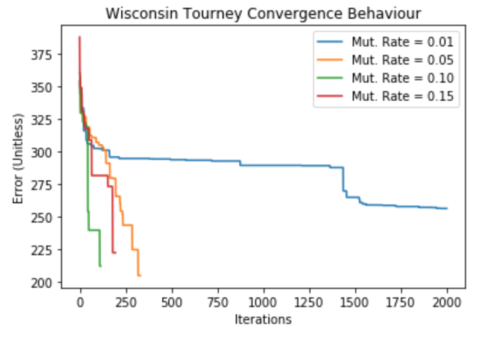
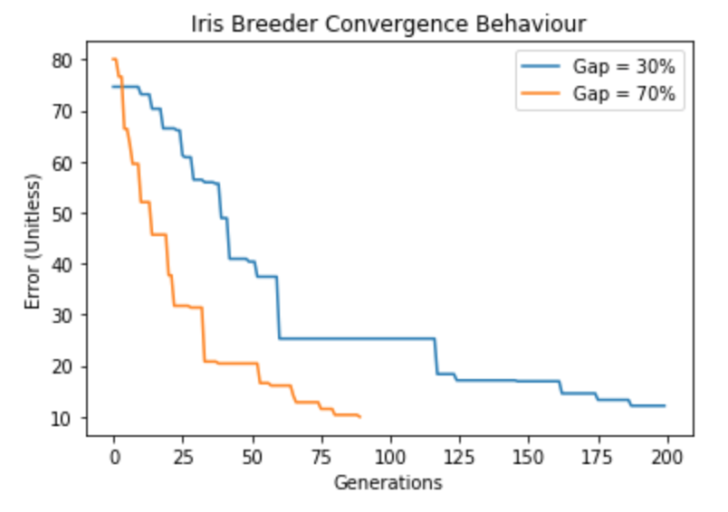
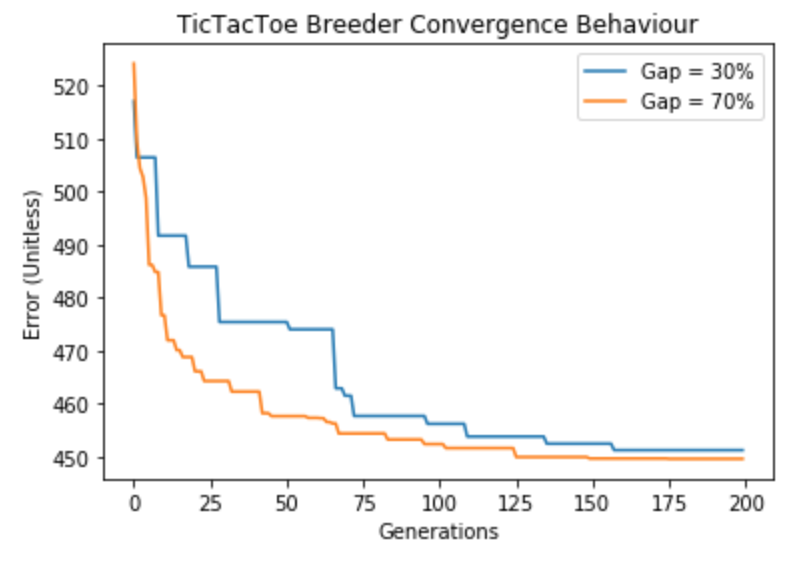
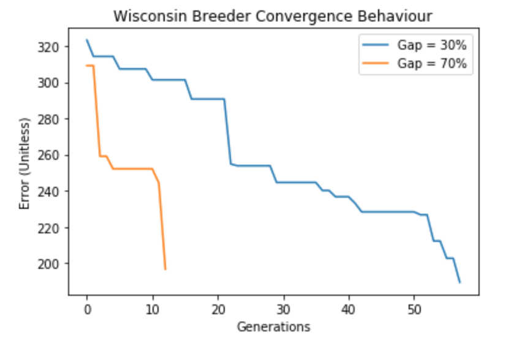

# Canonical Linear GP

**Taken from an assignment written for CSCI 6506 at Dalhousie University. Displayed here for easy access and because I tend to delete things.**

## Introduction and Purpose

The purpose of this work was to implement canonical linear genetic program evolution (GP) according to the assignment and, less strictly, to [1]. Specifically, GP was used to evolve binary and multiclass classifiers under both tournament- and breeder-style selection for multiple datasets. Initially two classifiers were evolved to predict the classic multiclass iris species dataset (<http://archive.ics.uci.edu/ml/datasets/Iris>) and the binary class tic-tac-toe endgame dataset (<http://archive.ics.uci.edu/ml/datasets/Tic-Tac-Toe+Endgame>), as specified in the assignment. An additional classifier was also evolved to predict the binary class Wisconsin breast cancer dataset (<https://archive.ics.uci.edu/ml/datasets/Breast+Cancer+Wisconsin+(Diagnostic)>). These datasets are described elsewhere and this report assumes that the reader is familiar with them.

As mentioned, both tournament- and breeder-style evolution and selection algorithms were implemented as described in the assignment and below. For both evolution algorithms, a specific configuration parameter was modified over several runs of evolution to evaluate the effects on convergence behaviour and final accuracy. For tournament-style evolution, the mutation rate was varied. For breeder-style evolution, the gap percent (percent of individuals surviving each generation) was varied. In both cases, the parameter varied was chosen purely out of curiosity after experimentation with the algorithms; the evaluations were not exhaustive and the experiments were not perfectly devised, but were rather an attempt to possibly shed light on some interesting behaviour observed during casual experimentation with the GP implementation.


## Implementation

Since the implementation is described in the assignment, this section will be restricted to specifics not implied by the assignment description. The genetic program was implemented entirely in Python. The genetic program itself is implemented as a class, *Program* and the experiments are performed and recorded in individual Jupyter notebooks. The implementation and notebooks are viewable at <https://github.com/MattAlanWright/PyGP>. A branch, *sandbox-1*, also contains the same results (and this write-up) and has been created to prevent future updates from destroying old information. The genetic program class as well as the evolution algorithms are implemented in *GeneticProgram.py* and the experiments are each contained in individual, descriptively-named notebooks (viewable directly on GitHub).

####Instructions, Mutation and Crossover

Instructions are recorded as nested lists: individual instructions are a list of integers representing the mode, target, operation and source, as described in the assignment, and each program maintains a list of these lists. Mutation and crossover are implemented as class methods and are independent of the style of evolution (breeder or tournament). Each instance of a *Program* is instantiated with a mutation rate (a floating point value between 0.0 and 1.0). Mutation is implemented as follows:

```
for each instruction in the program's list of instructions:
    n = uniformly-selected random number between 0.0 and 1.0
    if n > mutation rate:
    		skip to next instruction (don't mutate)
    		
    component = uniformly-selected random value from MODE, TARGET, OP, SOURCE

		instruction[component] = uniformly selected value from 0 to MAX_COMPONENT_VALUE
```

Obviously this explanation is very loose. The `MODE`, `TARGET`, `OP` and `SOURCE` values are integers indexing into the instruction and `MAX_COMPONENT_VALUE` is an integer between 0 and the maximum sensible value for whatever component is being mutated. Crossover is implemented as two-point crossover, exactly as described in class with a fixed crossover rate of 90% (ie. 90% of the time, crossover takes place).

### Evolution Algorithms (Selection and Variance Operations)

Both the tournament and breeder selection algorithms are implemented exactly as described in the assignment handout and so are only briefly touched on here. One notable decision that was left ambiguous in the assignment description is that when competitiors are chosen (four at a time) in tournaments and parents are chosen (two at a time) in breeder generations, these selections are done *without* replacement so that no two competitors or parents are ever the same individual.

###Execution and Prediction

Each *Program* instance has a list of 8 floating point values, used to represent the machine registers available to each program. These are zero-ed out before executing instructions.

After executing a program, predictions are defined to be the value in either register 0, for binary classification, or registers 0 to (number of classes - 1) for multiclass classification.

### Fitness

One significant deviation from typical GP that must be noted is the implementation of fitness evaluation. GP often implements fitness as a unitless scalar which measures the "goodness" of an individual. It has no inherent meaning but rather has relevance compared to the fitness of other individuals, with higher fitness being better. This implementation, however, takes its cues from standard machine learning classifier implementations and uses sigmoid (and softmax) smoothing operators on the output register(s) and cross-entropy error calculation. In this scenario, fitness is still unitless but is better referred to as "error" and lower is better. **Note that in the source code it is still named fitness. This is a potential source of confusion for anyone reading a less-than operator when they may expect a greater-than operator.**

###Data Splitting

For each dataset in both tournament and breeder evolution, the datatset was split into two portions: 80% was used for training and 20% used for testing. Before performing the split, each datatset was randomly shuffled to ensure that both portions maintained roughly the same class ratios as the entire dataset. This was performed with the *train_test_split* function from Sklearn's open-source *preprocessing* module (<https://scikit-learn.org/stable/modules/generated/sklearn.model_selection.train_test_split.html>).

To evaluate the best performer in any given evolution run, the accuracy on the training set was used. This was done to simulate real-world conditions, where the top performer would have to be selected wihtout necessarily having additional data to evaluate its performance on, ie. a real world classifier doesn't know what it will be classifiying until it has already been released for use.

### Computational Budget

No explicit efforts were made to ensure identical computational budget between tournament and breeder selection.

For tournament selection, the number of available evaluations is given by

$num\ evaluations = 4 * max\ tournament\ runs * num\ exemplars \propto 4 * max\ tourn.\ runs = 4 * 2000 = 8000$

For breeder selection, the same number is given by

$num\ evaluations = pop\ size * max\ generations * num\ exemplars \propto pop\ size * max\ gen. = 200 * 200 = 40000$

Clearly breeder selection is given a significantly higher computational budget, something that could be addressed in future experiments.

### Scaling

All datasets were scaled using the *MinMaxScaler* class from Sklearn's open-source *preprocessing* module (<https://scikit-learn.org/stable/modules/generated/sklearn.preprocessing.MinMaxScaler.html>). This class uses linear re-scaling. The scaler was derived using the training set and later applied to the test set. This is done to simulate real-world conditions, where the test set would not be available to the scaler, which must be learned at the same time that the GP is evolved.


## Experiments

### Tournament-Style Evolution

For tournament-style evolution, the mutation rate was varied while all other parameters were kept constant with the intent of evaluating the mutation rate's effect on convergence behaviour and, to a lesser degree, final accuracy. The values of mutation used were 0.01, 0.05, 0.1 and 0.15 (this is not entirely true for the tic-tac-toe datatset, described further below). For each value, five runs of tournament-style evolution were carried out with the following parameters:

| Parametes                           | Value |
| ----------------------------------- | ----- |
| Population size                     | 16    |
| Maximum number of instructions      | 1024  |
| Maximum number of tournament rounds | 2000  |
| Halting error (Iris)                | 10.0  |
| Halting error (tic-tac-toe)         | 200.0 |
| Halting error (Wisconsin)           | 200.0 |

In all three cases, the halting error was determined experimentally, ie. in casual, un-recorded experimentation, error values below the threshold listed tended to indicate convergence and a high final accuracy. If an instance of a GP reached the halting error, then the tournament stopped and that invididual was returned as the winner.

For each of the five runs at a given mutation rate, the best-so-far error value was recorded to view convergence behaviour. After five runs, the individual with the highest accuracy *on the training set* (of the five tournament winners) was determined to be the optimal individual: its accuracy on both the training and test set was reported and it was used in the final comparison of convergence behaviours across all mutation rates.

The hypothesis is that higher mutation rates will lead to steeper declines in error in the early stages of convergence (ie. will support exploration) and smaller mutation rates will aid optimization in the latter stage of convergence (ie. support exploitation). No assumption is made about final accuracy values.

###Breeder-Style Evolution

For breeder-style evolution, the gap percent (the percentage of individuals in the population killed off and replaced at each generation) was set to two different values, 30% and 70%, with the intention of viewing the difference in convergence behaviour between the case where a minority of the population is replaced and the case where a majority of the population is replaced. In each case, three runs of breeder-style evolution were carried out with the following parameters:

| Parameter                      | Value |
| ------------------------------ | ----- |
| Population size                | 200   |
| Maximum number of instructions | 1024  |
| Maximum number of generations  | 200   |

The halting error values used were the same as those used in tournament-style evolution.

For each of the three runs at a given gap percent, the best-so-far error value was recorded to view convergence behaviour. After three runs, the individual with the highest accuracy *on the training set* (out of the remaining population) was determined to be the optimal individual: its accuracy on both the training and test set was reported and it was used in the final comparison of convergence behaviours across both gap percent values. The hypothesis is that the higher gap percentage will lead to quicker convergence, since a higher percentage of the population is based on high performing individuals.


## Results

The results are viewable in their entirety in the Jupyter notebooks included in the GitHub link listed in the **Implementation** section and summarized below.

### Tic-Tac-Toe Accuracy

Before describing the results of the successful experiments on the iris and breast cancer datasets, it is important to discuss the, perhaps most telling, results from the experiment on the tic-tac-toe endgame dataset. These results are the most interesting because while the tic-tac-toe dataset seems like the most straight-forward (a human could quickly and easily derive classification rules by hand) it provided the GP with the most difficulty. The best-performing individuals ranged in accuracies of 63% to 69% on the test dataset. Given that the dataset in its entirety contains approximately 65.3% positive examples, the argument could easily be made that the final algorithms are doing little more than random guessing, which would have produced similar results.

The failure to achive a high accuracy on this dataset was the direct reason for including a third dataset: the Wisconsin breast cancer dataset is also a binary class dataset and was included to confirm that the GP implementation was indeed working in binary classification scenarios.

**Note:** Casual experimentation and comparisons with previous experiments had already strongly indicated that this was the upper bound on accuracy possible on the tic-tac-toe dataset with this implementation of GP. Therefore, in tournament selection, the experiment was not carried out for mutation rates of 0.01 and 0.15. This decision was made to save experiment time and because it is not obvious that convergence behaviour on the tic-tac-toe dataset is even meaningful.

### Tournament-style Evolution and Mutation Rate

####Convergence Behaviour

The plots below show the comparison of convergence behaviour among the best-performing individuals from each five runs using a particular mutation rate for all three datasets.







It is interesting that in the initial stages of convergence, error seems to descend equally quickly regardless of mutation rate (though this does not quite hold for the tic-tac-toe dataset), contradicting the first part of the hypothesis that higher mutation rates would support early exploration.

For the iris dataset, the second component of the hypothesis, that lower mutation rates would aid in exploitation, was shown to hold true for the runs recorded. The individuals with lower mutation rates reached lower final error values more quickly, confirming that the low mutation rate seems to aid in exploitation of an already-proven solution. Surprisingly, the opposite seems to be the case for the tic-tac-toe Wisconsin datasets. However, the data here is less clear: in the case of tic-tac-toe it is unclear that convergence is meaningful, and for Wisconsin, early stopping occurred in most runs so that one could argue that the second stage of convergence mentioned in the **Experiment** section was not reached.

The results ultimately do not point towards a higher or lower mutation rate (from the range tested) being better for fast convergence with all of those tested being equally useful, all datasets considered.

#### Accuracy

The table below lists the training and test accuracies recorded for each best performer across all mutation rates tested:

| Dataset     | Mutation Rate | Training Accuracy | Test Accuracy |
| ----------- | ------------- | ----------------- | ------------- |
| Iris        | 0.01          | 94%               | 97%           |
| Iris        | 0.05          | 93%               | 100%          |
| Iris        | 0.10          | 88%               | 87%           |
| Iris        | 0.15          | 92%               | 93%           |
| Tic-tac-toe | 0.05          | 69%               | 63%           |
| Tic-tac-toe | 0.10          | 71%               | 69%           |
| Wisconsin   | 0.01          | 95%               | 95%           |
| Wisconsin   | 0.05          | 94%               | 95%           |
| Wisconsin   | 0.10          | 87%               | 85%           |
| Wisconsin   | 0.15          | 95%               | 95%           |

For the iris dataset, these results show that a lower mutation rate may result in a greater final accuracy. However, casual experimentation with the algorithms prior to this experiment suggests that the truth is likely not that simple: runs of five tournaments with low mutation rates have often been observed that return a top performer that achieves well below 70% accuracy on the iris dataset, so this result would need significantly more investigation. Indeed, the results with the other datasets agree with this. The tic-tac-toe set suggests the opposite result, the higher mutation rates lead to higher accuracy (though, as has already been discussed, final accuracy of the tic-tac-toe dataset is of questionable relevance). The Wisconsin dataset shows no appreciable difference across mutation rates, with one aberration that, based on previous experimentation, was more likely due to poor luck. The convergence plot also shows that this model was stopped early based on the arbitrarily selected fitness value and may have further converged to something more accurate.

### Breeder-style Evolution and Gap Percent

####Convergence Behaviour

The plots below show the comparison of convergence behaviour among the best-performing individuals from each three runs using a particular gap percent for each run of evolution.







For breeder-style evolution, the hypothesis appears to hold that the higher gap percent (ie. killing off and replacing a majority of the population rather than the minority) seems to encourage quicker rates of convergence.

#### Accuracy

The table below lists the training and test accuracies recorded for each best performer across all mutation rates tested:

| Dataset     | Gap Percent | Training Accuracy | Test Accuracy |
| ----------- | ----------- | ----------------- | ------------- |
| Iris        | 30%         | 97%               | 90%           |
| Iris        | 70%         | 98%               | 97%           |
| Tic-tac-toe | 30%         | 72%               | 67%           |
| Tic-tac-toe | 70%         | 72%               | 67%           |
| Wisconsin   | 30%         | 91%               | 96%           |
| Wisconsin   | 70%         | 92%               | 94%           |

From these results, gap percentage seems to show little effect on the final accuracy achieved. Although there is a significant difference between the final accuracy on the test set for the iris dataset depending on the gap percentage used, previous experimentation has demonstrated that a drop of 7% in accuracy from training to test is not uncommon and is likely simply bad luck, ie. the gap percentage difference likely does not account for that, given that both gap percentage values achieved virtually identical training accuracy values, though this could be further explored. It is also important to note from that model's convergence behaviour that the model may have converged further to a


## Conclusion

Linear GP has both pros and cons when building predictive models. From the results on the tic-tac-toe dataset, it is apparent that some models prove significantly more difficult than others. These datasets entirely preclude the use of linear GP as implemented here. It is also apparent from the final accuracy tables that here is no guarantee that the final result will necessarily be the optimal approach. This is evident in the the iris dataset tournament run with a mutation rate of 0.10, the Wisconsin dataset tournament run with a mutation rate of 0.10 and the iris dataset breeder run with a gap percent of 30%. In all three cases, the final model showed $\leq$90% accuracy on datasets where linear GP is quite clearly capable of achieving nearly 100% accuracy. Other (unrecorded) experiments showed similar results, where evolution runs would often converge to entirely useless models. Ultimately, using linear GP to build a predictor requires the dataset to be well-suited to this model and repeated runs of evolution to ensure a useable model is produced. However, high accuracy models are still achievable in linear GP.


## Citations

[1] M. Brameier and W. Banzhaf. A comparison of linear genetic programming and neural
      networks in medical data mining. IEEE Transactions on Evolutionary Computation, 5(1):17–26,
      2001.