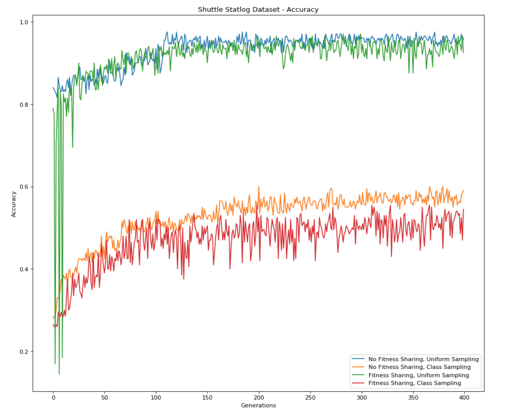
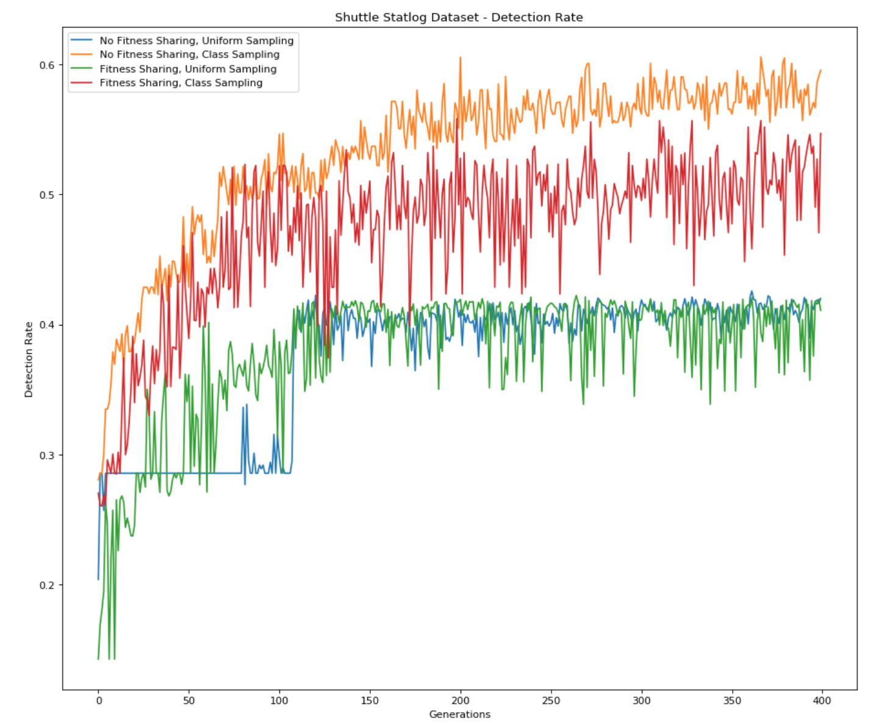
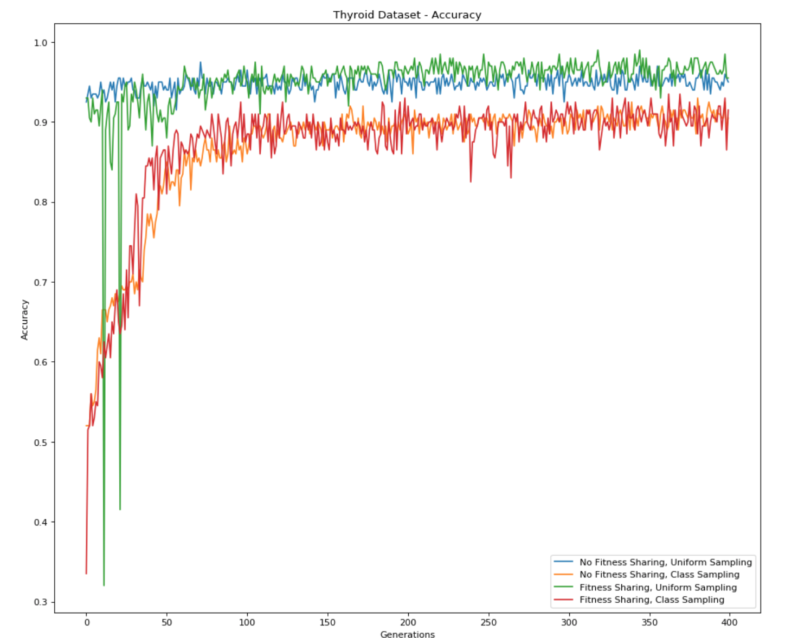
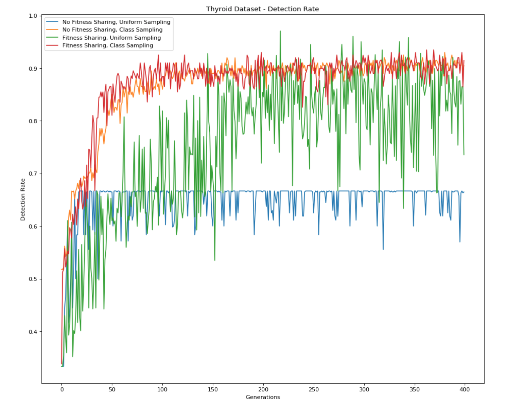

# Fitness Sharing

Matthew Wright

B00529448

## Introduction and Purpose

The purpose of this work was two-fold: to evaluate the usefulness of two different methods of dataset sampling, and to evaluate the usefulness of fitness sharing during selection over standard fitness measurement, both in the case of training canonical linear genetic programming (GP) classifiers on large, unbalanced datasets.

### Dataset Sampling

Because datasets may be sufficiently large to preclude evaluating all GP individuals on every training exemplar in a classification dataset in a reasonable amount of time, dataset sampling is proposed as a method to create a training environment that can be evaluated much more quickly. This environment consists of a small subset of the entire dataset that, hopefully, adequately reflects the general characteristics of the full dataset so that GPs trained on the subset may generalize to the full dataset.

This experiment looks at the results of two different dataset sampling methods: uniform sampling of the training dataset, and class-balanced sampling in which each class in a multiclass training dataset is represented by an equal number of exemplars in the subset. In ideal circumstances, uniform sampling would be an accurate representation of the dataset using substantially less exemplars and is intended to facilitate evolution of GPs that generalize well to the rest of the dataset. Class-balanced sampling is intended to give all classes equal representation in the training data and so encourage evolution of GPs that achieve a high per-class performance metric (described in the **Experiments** section).

### Fitness Sharing

One possible, and simple, measure of the fitness of a GP instance is the number of exemplars it classifies correctly. This is effectively the accuracy un-normalized by the total number of exemplars. If an outcome matrix $G$, defined as

​                                      $G(m_i, p_k) = $ 1 IF program $m_i$ correctly classifies exemplar $p_k$ ELSE 0

is constructed at each generation, where $p_k$ is an exemplar in the subset, then the fitness of each program can be measured as

​                                                                                   $f_i = \sum_{k} G(m_i, p_k)$

or the summation across each row of the outcome matrix.

However, this measure of fitness suffers if the dataset is unbalanced, ie. one class represents a majority of the dataset. In this case, GP individuals that consitently predict the same value may achieve a very high level of fitness, while a GP that succeeds in learning to distinguish those classes represented by very few exemplars will only show a marginal increase in fitness. This marginal increase may not be enough to guarantee reproduction; the GP may fail to distinguish itself from uniform guessers and so may not sufficiently increase its chances of selection. To overcome this limitation of the fitness measure described, fitness sharing is introduced. Given the same outcome matrix $G$, fitness as measured under the fitness sharing method is defined as:

​                                                                               $f_i = \sum_k \frac{G(m_i, p_k)}{1 + \sum_j G(m_j, p_k)}$

ie. each entry $G(m_i, p_k)$ is normalized by the number of programs that successfully classified exemplar $p_k$ (plus 1 to ensure safe division). This way, when summing across each row of the normalized matrix $G$, "easy" exemplars are now worth much less than 1 and contribute less to the overall fitness of the program. To increase its fitness, a program necessarily must learn to correctly classify exemplars from those classes that are underrepresented in the dataset. This encourages diversity among individuals in a population since it prevents convergence on a single high-performer that can leverage a class imbalance. Like the class-balanced sampling, in canonical GP this approach is intended to have the effect of encouraging individuals that perform well across all classes and avoid the trap of wringing high but misleading performance out of a highly unbalanced class in the dataset. 

## Experiments and Implementation

This work is designed to answer several questions in parallel. The primary question of interest when performing uniform sampling is whether high accuracy may be achieved by a GP individual using only a subset of the data and that that individual's performance will generalize well to the entire dataset. Since a uniformly sampled subset is ideally the most accurate representation of the entire dataset, this would help validate the dataset sampling approach to GP evolution, which would in turn facilitate evolving useful GP individuals on large datasets in significantly less time.

The second question under investigation is the effect of both balanced class sampling and fitness sharing, individually and in combination, on GP performance metrics that better represent per-class performance.

### GP Implementation

This work implements linear canonical GP as described in class and as used in the first sandbox, with the following parameters:

| Parameter                      | Value                                              |
| ------------------------------ | -------------------------------------------------- |
| Number of registers            | 8                                                  |
| Instruction types              | Addition, subtraction, mutliplication and division |
| Maximum number of instructions | 96                                                 |
| Mutation rate                  | 0.1                                                |

Breeder-style evolution was implemented, again as discussed in class and the previous sandbox, with the addition of exemplar sampling at each generation. One of the two fitness measurements described above was used. The following configuration was shared by all evolution runs:

| Parameter                                | Value |
| ---------------------------------------- | ----- |
| Population size                          | 100   |
| Population gap size                      | 70    |
| Maximum number of generations            | 200   |
| Number of points sampled each generation | 200   |

### Datasets

These experiments used two datasets from the UCI Machine Learning Repository. The shuttle statlog dataset, https://archive.ics.uci.edu/ml/datasets/Statlog+(Shuttle), and the thyroid dataset, [http://archive.ics.uci.edu/ml/datasets/Thyroid+Disease](http://archive.ics.uci.edu/ml/datasets/Thyroid+Disease). These are both multiclass datasets with strong class imbalances, with the majority class accounting for ~80% of the shuttle dataset and ~92% of the thyroid dataset.

### Evaluation Methods

Two different methods were used to evaluate the performance of the GP.

#### Accuracy

For a single GP instances, accuracy was simply measured as:

​                                                         $Accuracy = \frac{number\ of\ exemplars\ classified\ correctly}{total\ number\ of\ exemplars}$

where the total number of exemplars depends on the dataset being used for evaluation. This performance measurement is used to measure the "goodness" of a GP individual under the premise that the ultimate objective of GP evolution is to develop an accurate classifier.

#### Detection Rate

Detection rate, or the average recall, is defined as:

​                                                                    $Detection\ rate = \frac{1}{\left|C\right|} \sum_{c = 1}^{\left|C\right|} \frac{tp_c}{tp_c + fn_c}$

where $\left|C\right|$ is the number of classes, $tp_c$ is the number of true positives for class $c$, and $fn_c$ is the number of false negatives for class $c$. This evaluation metric better represents an individual's ability to balance its performance across all classes in the dataset, even if a higher final accuracy could be achieved by exploiting a class imbalance.

### Experiments

All four combinations of uniform sampling vs balanced sampling and standard fitness vs fitness sharing were implemented. In each of the four cases, five runs of evolution were performed under the configuration described above. Accuracy and detection rate of the best individual at each generation was evaluated on the subset of exemplars used during that generation and recorded. After all five runs were complete, the median per-generation accuracy and detection rate were plotted to visualize convergence behaviour. The accuracy and detection rate of the top performer from all five runs of evolution was measured on the full test and training datasets and the median values were reported.

## Results

### Top-Performer Metrics

#### Shuttle Statlog Dataset

The final accuracy and detection rates for the shuttle statlog dataset are shown below. These are the median results for the five top performers from all five evolutionary runs under a given configuration. For example, under no fitness sharing and uniform sampling, the accuracies below were collected by taking the top performer from each of the five evolution runs under this configuration, evaluating their accuracy on the training and test set and taking the median result. Note that the majority class in this dataset makes up approximately 80% of the dataset.

**Accuracy**

| Fitness Paradigm | Sampling Method | Dataset | Accuracy (%) |
| ---------------- | --------------- | ------- | ------------ |
| No sharing       | Uniform         | Train   | 95.64        |
| No Sharing       | Uniform         | Test    | 95.63        |
| No Sharing       | Class-balanced  | Train   | 73.65        |
| No Sharing       | Class-balanced  | Test    | 74.02        |
| Sharing          | Uniform         | Train   | 92.58        |
| Sharing          | Uniform         | Test    | 92.32        |
| Sharing          | Class-balanced  | Train   | 71.22        |
| Sharing          | Class-balanced  | Test    | 71.59        |

**Detection Rate**

| Fitness Paradigm | Sampling Method | Dataset | Detection Rate |
| ---------------- | --------------- | ------- | -------------- |
| No sharing       | Uniform         | Train   | 0.404          |
| No Sharing       | Uniform         | Test    | 0.404          |
| No Sharing       | Class-balanced  | Train   | 0.578          |
| No Sharing       | Class-balanced  | Test    | 0.535          |
| Sharing          | Uniform         | Train   | 0.399          |
| Sharing          | Uniform         | Test    | 0.399          |
| Sharing          | Class-balanced  | Train   | 0.520          |
| Sharing          | Class-balanced  | Test    | 0.510          |

Several things are apparent in these results. Given that both fitness sharing and standard fitness measurements both achieve a relatively high accuracy when trained on uniformly sampled subsets, it is apparent that the sampling technique is, at least to some degree, viable in GP evolution: the programs are indeed able to learn and generalize from small subsets of data. Further experiments would be required to determine if final accuracy increases if evolution uses the entire training dataset.

From the accuracy results for class-balanced sampling, it is apparent that this method of sampling does hinder the final accuracy achiveable through evolution, though this is not unexpected, since evolution using class-balanced sampling cannot learn to leverage the majority dataset to achieve higher accuracy.

It is also noteworthy that for both uniform sampling and class-balanced sampling, accuracy decreases when fitness sharing is applied.

The results for detection rate on this dataset are particularly interesting in that, both for uniform sampling and class-balanced sampling, the detection rate also decreased when fitness sharing was applied. This is surprising given that fitness sharing is intended to prevent GP from leveraging class imbalance and create more balanced classifiers. The biggest factor in class balance when measured by detection rate appears to be balanced class sampling, which strongly encourages higher detection rates.

#### Thyroid Dataset

The final accuracy and detection rates for the thyroid dataset are shown below. Note that the majority class in this dataset makes up approximately 92% of the dataset.

**Accuracy**

| Fitness Paradigm | Sampling Method | Dataset | Accuracy (%) |
| ---------------- | --------------- | ------- | ------------ |
| No sharing       | Uniform         | Train   | 94.30        |
| No Sharing       | Uniform         | Test    | 93.93        |
| No Sharing       | Class-balanced  | Train   | 94.35        |
| No Sharing       | Class-balanced  | Test    | 92.68        |
| Sharing          | Uniform         | Train   | 94.03        |
| Sharing          | Uniform         | Test    | 92.53        |
| Sharing          | Class-balanced  | Train   | 91.46        |
| Sharing          | Class-balanced  | Test    | 89.76        |

**Detection Rate**

| Fitness Paradigm | Sampling Method | Dataset | Detection Rate |
| ---------------- | --------------- | ------- | -------------- |
| No sharing       | Uniform         | Train   | 0.630          |
| No Sharing       | Uniform         | Test    | 0.646          |
| No Sharing       | Class-balanced  | Train   | 0.906          |
| No Sharing       | Class-balanced  | Test    | 0.889          |
| Sharing          | Uniform         | Train   | 0.797          |
| Sharing          | Uniform         | Test    | 0.747          |
| Sharing          | Class-balanced  | Train   | 0.897          |
| Sharing          | Class-balanced  | Test    | 0.889          |

Results for the hypothryroid dataset are less informative than those for the shuttle statlog dataset. Bearing in mind that the majority class in this dataset makes up approximately 92% of exemplars and given that most final accuracy values hover very near 92%, it is unclear that evolution is producing meaningful results. However, the results for detection rate again seem to indicate that the best way to achieve a high detection rate is with class-balanced sampling and no fitness sharing.

### Convergence Behaviour

#### Shuttle Statlog Dataset

The plots below show the accuracy and detection rate as measured at each generation on the current data subset available to that generation.

This behaviour provides further indicators of the results discussed above. First, the most significant factor determining convergence behaviour is the sampling method rather than the fitness measurement method, such that uniform sampling results in the highest accuracy and class-balanced sampling results in the highest detection rate. Second, the highest detection rate is achieved by class-balanced sampling and no fitness sharing, surprising given that fitness sharing is intended to achieve a high detection rate.

#### Thyroid Dataset

The results on the thyroid dataset appear to further confirm the results discussed and also shed some light on the meaningfulness of the accuracy data. For uniform sampling, the accuracy curves indicate that, likely, GP is not evolving anything much more meaningful than random guessing and is failing to produce useful individuals. In the case of class-balanced sampling, however, there is a distinct increase from ~50% accuracy up to ~90%. Since these results are based on the accuracy of the individuals on each generation's data subset this does show that under balanced class sampling, GP is forced to learn to distinguish between classes. In the case of the thyroid dataset, where uniform sampling produces likely nearly uniform guessers, the class-balanced behaviour is actually more useful and highlights the benefits of class-balanced sampling.

For detection rate, class-balanced sampling again results in the steepest increase and highest final result. The results from the thyroid set further reinforce the fact that fitness sharing seems to provide little benefit over standard fitness measurements, with most of the benefits being achieved through the sampling method.

## Conclusions

As noted in the introduction, fitness sharing is intended to do two things: it is intended to directly encourage diversity in the population and, through this diversity, indirectly encourage individuals that perform better across all classes of exemplars. From the results above it seems that the latter effect is not produced by fitness sharing, specifically in the case of canonical linear GP. Under canonical linear GP, better class balance in individuals is much more strongly encouraged by a class-balanced sampling method in exemplar subset generation and so it does not seem worthwhile to add the extra computational overhead of the more complex fitness calculation. However, these experiments are not designed to directly measure or even directly benefit from diversity in a population. It may be the case that fitness sharing is encouraging diversity as intended but canonical GP is not well-suited to leverage this diversity given that canonical GP ultimately produces a single individual classifier.

In the case of the different sampling methods, the results of these experiments are highly encourgaing. Not only does dataset sampling, even in a very simple form (resampling uniformly every generation), appear to be a viable method of evolving useful, reasonably accurate programs, but changing to a sampling method that ensures that all classes in the subset are equally represented in the subset strongly encourages more balanced performance, as indicated by the significant increase in detection rate. These results show that evolution can be performed much more quickly using a data subset, and that tuning the ratio of classifiers in the subset can strongly encourage different potentially desirable outcomes in the resulting programs.

